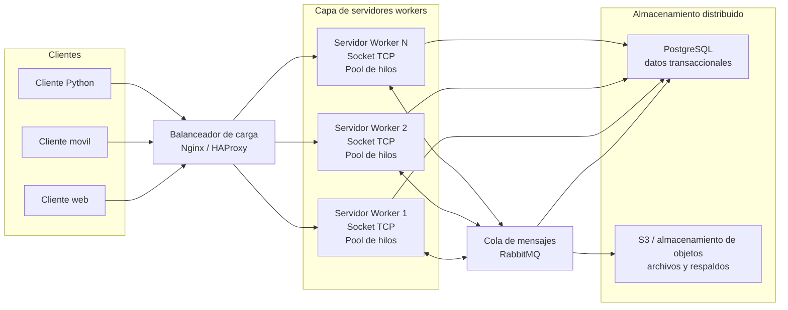

# Diagrama del sistema distribuido

## Descripcion breve

Los clientes se conectan al balanceador de carga, que reparte las conexiones entre varios servidores worker. Cada servidor mantiene un pool de hilos para procesar tareas concurrentes. RabbitMQ permite desacoplar tareas entre servidores y PostgreSQL/S3 representan el almacenamiento distribuido para datos y archivos.
